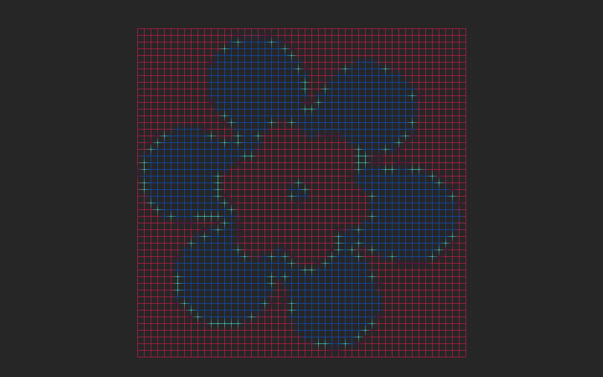

# 🗺️ 📈 FDF — Wireframe Viewer
This is my implementation of the 42 FDF project using the Codam [MLX42](https://github.com/codam-coding-college/MLX42) graphics library.

## ⚠️ License
This project does not have an open source license.
It is published for educational purposes only — please do not reuse or submit this code as your own work.  
However, you are welcome to use and modify my custom maps from the `tkremnov_maps` folder.

## 📂 Project Structure
- `src/`: Source files  
- `include/`: Header files  
- `libft/`: Custom library functions  
- `Makefile`: Build instructions  
- `tkremnov_maps/`:  My custom `.fdf` maps  
- `screenshots/`: Example screenshots  

## 🗺️ How to Run
**1. Clone this repository**
   ```bash
   git clone git@github.com:TanyaKremnova/fdf.git
   cd fdf
   ```

**2. Install MLX42 (Codam’s version)**
Go to the official repo and follow the instructions:  
https://github.com/codam-coding-college/MLX42.git

**3. Build FDF**
   ```bash
   make
   ```

**4. Run**
   ```bash
   ./fdf tkremnov_maps/baby_yoda.fdf
   ```

## 🎮 Controls
Here’s how to interact with the wireframe map:

| Key               | Action                           |
| ----------------- | -------------------------------- |
|  `W` `A` `S` `D`  |  Move map up, left, down, right  |
|  `+` / `-`        |  Zoom in / out                   |
|  `I`              |  Isometric projection            |
|  `T`              |  Top-down projection             |
|  `P`              |  Parallel projection             |
|  `←` `→`          |  Rotate left / right (X-axis)    |
|  `↑` `↓`          |  Rotate up / down (Z-axis)       |
|  `Space`          |  Reset to default view           |
|  `Esc`            |  Close the window                |

## 📸 Custom Maps Gallery
Explore my handmade `.fdf` maps rendered in different projections^^

## 🖼️ Example Screenshots

Here’s my `baby_yoda.fdf` map rendered in isometric view:  


Another view with top-down projection:  


And views with rotation applied:  
  


---

The `butterfly.fdf` map rendered in isometric view:  


Zoomed-in view:  


View with top-down projection:  


View with rotation applied:  


---

The `flower.fdf` map rendered in isometric view:  


View with top-down projection:  


View with parallel projection:  


View with rotation applied:  


---

The `hearts.fdf` map rendered in isometric view:  


View with top-down projection:  


View with parallel projection:  


---

The `tryzub.fdf` map rendered in isometric view:  


View with top-down projection:  


Views with parallel and rotated projection:  
  


## 👩🏻‍💻 Author
- Tanya Kremnova ([@TanyaKremnova](https://github.com/TanyaKremnova))